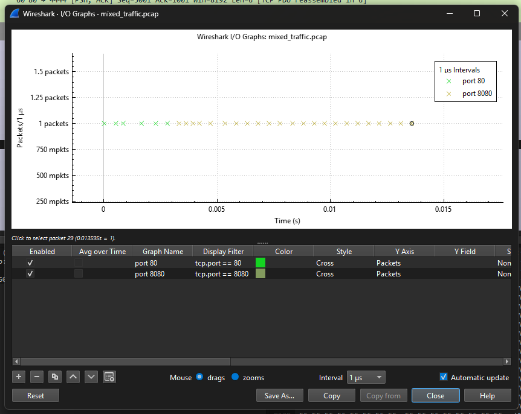

# Assignment: Traffic Characterization & Flow Analysis
## Objective
Distinguish between application types by analyzing flow statistics and packet size distribution in a mixed-traffic environment.

1. The 'Conversations' Snapshot

    1. Open mixed_traffic.pcap and navigate to Statistics -> Conversations -> TCP.
    ```json
    [
        {
            "Address A": "10.0.0.1",
            "Address B": "10.0.0.2",
            "Bits/s A → B": "",
            "Bits/s B → A": "",
            "Bytes": "355",
            "Bytes A → B": "108",
            "Bytes B → A": "247",
            "Duration": "0.002811",
            "Flows": "1",
            "Packets": "6",
            "Packets A → B": "2",
            "Packets B → A": "4",
            "Port A": "4444",
            "Port B": "80",
            "Rel Start": "0",
            "Stream ID": "0"
        },
        {
            "Address A": "10.0.0.1",
            "Address B": "10.0.0.2",
            "Bits/s A → B": "83989",
            "Bits/s B → A": "23590162",
            "Bytes": "30442",
            "Bytes A → B": "108",
            "Bytes B → A": "30334",
            "Duration": "0.010287",
            "Flows": "1",
            "Packets": "23",
            "Packets A → B": "2",
            "Packets B → A": "21",
            "Port A": "5555",
            "Port B": "8080",
            "Rel Start": "0.003308",
            "Stream ID": "1"
        }
    ]
    ```

    2. Compare the 'Bytes' and 'Packets' columns for both rows. Which Stream ID corresponds to the 'Chat' and which to the 'Video'? Justify your answer using the data.
        Stream 0 is the chat, as the communication is both way is way more similar (108bytes and 247bytes) than the Stream 1 where one side sends 30kB of data but receives on 108bytes

    3. Calculate the average packet size for each stream. How does this relate to the application's likely purpose?
        Stream 0 355bytes, 6packets -> ~59bytes per packet
        Stream 1 30kB, 23packets -> ~1300bytes per packet

2. Packet Size Distribution

    4. Navigate to Statistics -> Packet Lengths.
        
        ==================================================================================================================================
        Packet Lengths:
        Topic / Item       Count         Average       Min Val       Max Val       Rate (ms)     Percent       Burst Rate    Burst Start  
        ----------------------------------------------------------------------------------------------------------------------------------
        Packet Lengths     29            1061.97       54            1514          2.1331        100%          0.2900        0.000        
        0-19              0             -             -             -             0.0000        0.00%         -             -            
        20-39             0             -             -             -             0.0000        0.00%         -             -            
        40-79             9             57.44         54            67            0.6620        31.03%        0.0900        0.000        
        80-159            0             -             -             -             0.0000        0.00%         -             -            
        160-319           0             -             -             -             0.0000        0.00%         -             -            
        320-639           0             -             -             -             0.0000        0.00%         -             -            
        640-1279          0             -             -             -             0.0000        0.00%         -             -            
        1280-2559         20            1514.00       1514          1514          1.4711        68.97%        0.2000        0.000        
        2560-5119         0             -             -             -             0.0000        0.00%         -             -            
        5120 and greater  0             -             -             -             0.0000        0.00%         -             -            

        ----------------------------------------------------------------------------------------------------------------------------------
        

    5. Identify the two distinct spikes in the distribution graph. Explain what each represents in the context of these two applications.
        the two spikes are `40-79` and `1280-2559`,
        `40-79` are quite small packets, so they could be ACK packets for the handshake between the machines
        `1280-2559` are quite large packets, so they are more probably related to the video transmission app

    6. Why does the 'Chat' application result in significantly smaller (control) overhead compared to the 'Video' stream?
        I did not find direct explanation for this, but I would say that it is related to not loosing data and as the video stream as more packet and bigger packet then there is more risk to have integrity problem, therefor it meeds more controls to keep the strem reliable

3. Throughput & I/O Graphs

    7. Open Statistics -> I/O Graphs. Create filters for 'tcp.port == 80' and 'tcp.port == 8080'.
        

    8. Set the Y-Axis to 'Bits/Sec'. What is the peak throughput of each stream?
        for port 80 it is like 2.8kB, for 8080 more like 241kB

    9. If you were to apply a Machine Learning model to classify these flows, which three statistical features would be most reliable for identification?
        Naturally I would say the packet size and frecuency, but that could potentialy instead be a factor which create a bias to the model as they may be 2factors way too prominent, ratio of send/received could also be an interesting factor